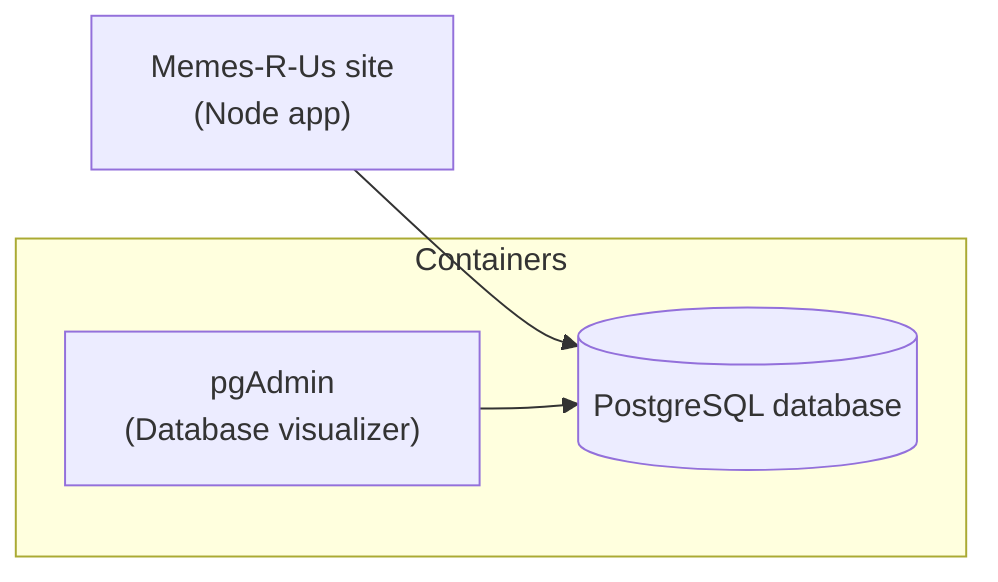

# 👋 Welcome!

This Labspace is designed to help you **learn about using containers to run your app's dependent services**. 

These might include:

- **Databases** - run [PostgreSQL](https://hub.docker.com/_/postgres), [MySQL](https://hub.docker.com/_/mysql), [Mongo](https://hub.docker.com/_/mongo), and more
- **Message queues** - run [RabbitMQ](https://hub.docker.com/_/rabbitmq), [Redis](https://hub.docker.com/_/redis), [Kafka](https://hub.docker.com/r/apache/kafka), and more
- **Cloud emulators** - run [LocalStack](https://hub.docker.com/r/localstack/localstack)
- And more!

The goal is to learn how to use containers to enable you and your team to quickly launch these services, configure them, and easily version them.

## 💻 The Memes-R-Us website

For the remainder of this lab, you are a member of the Memes-R-Us development team. Congrats! 🎉

The Memes-R-Us app is a simple website that displays memes and a welcome message.

In order to run it though for development, you need a database. You'll learn how to launch that in a container, as well as how to add additional developer tools.

