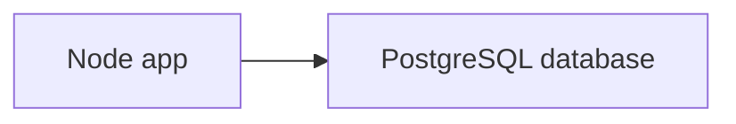

# Starting the dev environment

The app (for right now) isn't using containers. You'll make this change as your first task. 

The Memes-R-Us website is fairly simple. It is a Node app with a PostgreSQL database.




## Starting the app

If you haven't done so, open the VS Code environment in the panel on the right.

> [!NOTE]
> All commands in this Labspace must be run in a terminal in Labspace-provided VS Code editor.

1. Install the Node dependencies by running the following command:

    ```bash
    npm install
    ```

2. Start the app by running the following command:

    ```bash
    npm run dev
    ```

    This will start the app using `nodemon`, which will automatically restart the app when changes are made.

3. Open your browser to http://localhost:3000 to see if the app launched.

    Instead of the app, you should see the following error:

    ```plaintext no-copy-button
    Error: connect ECONNREFUSED 127.0.0.1:5432
        at /home/coder/project/node_modules/pg-pool/index.js:45:11
        at process.processTicksAndRejections (node:internal/process/task_queues:105:5)
        at async getRandomMeme (/home/coder/project/src/db.js:12:17)
        at async /home/coder/project/src/index.js:17:22
    ```

    This is because the app is trying to connect to a postgres database, but it isn't up and running yet.


## ▶️ Starting PostgreSQL

Containers make it incredibly wasy to run a PostgreSQL database. Let's see how easy!

1. Use the `docker run` command in a terminal to start a PostgreSQL container:

    ```bash terminal-id=labspace2
    docker run -d --name=postgres -p 5432:5432 -e POSTGRES_PASSWORD=secret postgres:17-alpine
    ```

   This command is using the following flags:

    - `-d` - run the container in "detached" mode. This runs the container in the background.
    - `--name postgres` - give this container a specific name. Normally, this flag is skipped and an auto-generated name is used. But, it helps in workshop settings.
    - `-p 5432:5432` - this "publishes" the port, allowing us to access the database running inside the container's isolated environment
    - `-e POSTGRES_PASSWORD=secret` - this container requires configuration to set the admin password. This flag sets that as an environment variable.
    - `postgres:17-alpine` - this is the name of the container image to run

    The output that you see is the full container ID.

2. To view the running containers, you use the `docker ps` command:

    ```console
    docker ps
    ```

    After running the previous command, you should see output similar to the following:

    ```plaintext no-copy-button
    CONTAINER ID   IMAGE                COMMAND                  CREATED         STATUS         PORTS                                         NAMES
    6ca807b3208e   postgres:17-alpine   "docker-entrypoint.s…"   2 seconds ago   Up 2 seconds   0.0.0.0:5432->5432/tcp, [::]:5432->5432/tcp   postgres
    ```

    Hooray! It's running! 
    
    > [!IMPORTANT]
    > This single command helps illustrate the power of a container. Containers make running apps easy. **No installs. No setup. Just run.**

3. Connect to the database using the `psql` tool:

    ```bash
    psql -h localhost -U postgres
    ```

    When you're prompted for the password, enter the password we defined in the command:

    ```bash
    secret
    ```

    You should now be connected! It worked! 🎉

5. Disconnect from the database by running the following command from inside the `psql` tool:

    ```bash
    \q
    ```

6. To configure the app to connect to the database, create a `.env` file with the following content:

    ```dotenv save-as=.env
    PGHOST=localhost
    PGPORT=5432
    PGUSER=postgres
    PGPASSWORD=secret
    PGDATABASE=postgres
    ```
    
7. With the database running and the app configured, the app should work, right? But, opening the site now gives us another error:

    ```plaintext
    error: relation "memes" does not exist
        at /home/coder/project/node_modules/pg-pool/index.js:45:11
        at process.processTicksAndRejections (node:internal/process/task_queues:105:5)
        at async getRandomMeme (/home/coder/project/src/db.js:8:17)
        at async /home/coder/project/src/index.js:18:22
    ```

    You're getting this error because the required tables aren't in the database.


## ➕ Populating the database

Docker's database container images provide the ability to load "seed" files into the container, making it easy to create tables and provide data at startup.

In the following steps, you are going to create the schema files and then update the database to run them at startup.

1. In the project, create a folder named `db`. You can either do so using the IDE directly or by running the following command:

    ```bash
    mkdir db
    ```

2. In the `db` folder, create a file named `01-create-schema.sql` with the following contents:

    ```sql save-as=db/01-create-schema.sql
    CREATE TABLE memes (
        "id" SERIAL NOT NULL PRIMARY KEY,
        "url" varchar(255) NOT NULL,
        "creation_date" DATE NOT NULL DEFAULT CURRENT_TIMESTAMP
    );
    ```

    This will create a simple table named `memes` that will have three columns - the ID of the meme, its URL, and a timestamp for when it was created.

3. In the `db` folder, create a file named `02-initial-data.sql` with the following contents:

    ```sql save-as=db/02-initial-data.sql
    INSERT INTO memes (url) VALUES 
        ('https://media.giphy.com/media/FaKV1cVKlVRxC/giphy.gif'),
        ('https://media.giphy.com/media/CAmbqvnwDk4jAqnLg9/giphy.gif'),
        ('https://media.giphy.com/media/6AFldi5xJQYIo/giphy.gif');
    ```

    This will insert three memes into the table, specifying only the URLs. The ID and creation timestamps are automatically generated for us by the database.

4. Before updating the database container to use these files, you will need to remove the current database container. Do so with the `docker rm` command:

    ```bash
    docker rm -f postgres
    ```

    The `-f` flag will stop the database before removing the container.

5. Use the following command to share the schema files from your workspace into the container (this is called bind mounting):

    ```bash
    docker run -d --name=postgres \
        -p 5432:5432 \
        -v ./db:/docker-entrypoint-initdb.d \
        -e POSTGRES_PASSWORD=secret \
        postgres:17-alpine
    ```

    This command adds the `-v ./db:docker-entrypoint-initdb.d` flag, which tells Docker to share the local `./db` directory into the container at `/docker-entrypoint-initdb.d`.

    The `/docker-entrypoint-initdb.d` directory is a special directory the container is designed to look at when starting up. If there are files there, it'll automatically import them into the database.

6. To confirm the data exists in the database, use the following `psql` command:

    ```bash
    psql -h localhost -U postgres -c "SELECT * FROM memes"
    ```

    After entering the password (which is `secret`), you should see output similar to the following:

    ```plaintext no-copy-button
      id |                            url                            | creation_date 
    ----+------------------------------------------------------------+---------------
      1 | https://media.giphy.com/media/FaKV1cVKlVRxC/giphy.gif.     | 2025-08-19
      2 | https://media.giphy.com/media/CAmbqvnwDk4jAqnLg9/giphy.gif | 2025-08-19
      3 | https://media.giphy.com/media/6AFldi5xJQYIo/giphy.gif      | 2025-08-19
    (3 rows)
    ```

    Hooray! The database is populated and ready to go!

4. Go back to the app (at http://localhost:3000) and validate it works now!


## 🐳 Using Compose to make everything easier

Hopefully, you're starting to see how Docker makes it easy to run services. No need to install anything. Very simple configuration. It just works!

But, if your app starts to have quite a few services, telling team members to run a bunch of `docker run` commands is a lot of work.

That's where Docker Compose comes in! With Compose, you can create a `compose.yaml` that defines everything.

1. Before you create the Compose file, remove the running database container:

    ```bash
    docker rm -f postgres
    ```

2. At the root of the project, create a file named `compose.yaml` with the following contents:

    ```yaml save-as=compose.yaml
    services:
      db:
        image: postgres:17-alpine
        ports:
          - 5432:5432
        volumes:
          - ./db:/docker-entrypoint-initdb.d
        environment:
          POSTGRES_PASSWORD: secret
    ```

    You should probably recognize this has almost all of the same config from the previous `docker run` commands, but just in a different format.

3. Start the app now by using `docker compose`:

    ```bash
    docker compose up -d
    ```

    The `-d` will run everything in the background. But, you should see output indicating the containers have started:

    ```plaintext no-copy-button
    [+] Running 2/2
    ✔ Network project_default  Created            0.0s 
    ✔ Container project-db-1   Started            0.2s 
    ```

4. To prove it's working, run the following commands to delete all of the memes in the database and then add a new one:

    ```bash
    psql -h localhost -U postgres -c "DELETE FROM memes"
    ```

    And add another one into the database:

    ```bash
    psql -h localhost -U postgres -c "INSERT INTO memes (url) VALUES ('https://media.giphy.com/media/l0MYt5jPR6QX5pnqM/giphy.gif')"
    ```

5. Refresh the browser several times and you should only see a single celebratory meme.

## 🐳 Docker Recap

Before moving on, let's take a step back and focus on what we learned.

- 🎉 **No install required.** PostgreSQL is running in a container with minimal effort or setup required. Even with database schema setup!
    - Docker provides many options to configure and troubleshoot containers
- 🎉 **Compose makes things easy.** If we add the Compose file to our repo, other team members only need to `git clone` and run `docker compose up`. Everything will be there for them.
    - Everyone is on the same version of the database. If a new version comes out, we only need to update the Compose file and everyone will be updated.


## Next steps

Now that you've added a containerized service, let's add one more capability to our dev environment to make it easier for developers... troubleshooting and debugging tools!
